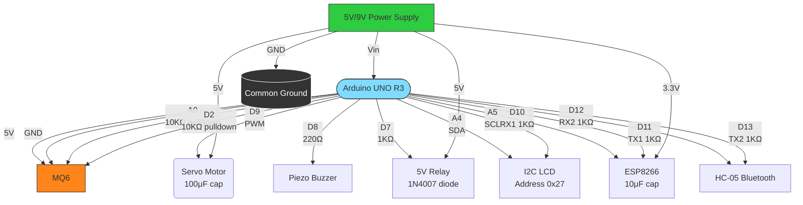

# LPG Gas Leak Detector Circuit Diagram

```mermaid
flowchart TB
    %% Power Section
    PSU[5V/9V Power Supply] -->|Vin| ARDUINO
    PSU -->|GND| GND[(Common Ground)]
    
    %% Arduino Connections
    ARDUINO([Arduino UNO R3]) -->|5V| MQ6
    ARDUINO -->|GND| MQ6
    ARDUINO -->|A0\n10KΩ pulldown| MQ6
    ARDUINO -->|D2\n10KΩ pulldown| MQ6
    
    %% Output Devices
    ARDUINO -->|D9\nPWM| SERVO(Servo Motor\n100μF cap)
    ARDUINO -->|D8\n220Ω| BUZZER[Piezo Buzzer]
    ARDUINO -->|D7\n1KΩ| RELAY[5V Relay\n1N4007 diode]
    
    %% Communication
    ARDUINO -->|A4\nSDA| LCD[I2C LCD\nAddress 0x27]
    ARDUINO -->|A5\nSCL| LCD
    ARDUINO -->|D10\nRX1 1KΩ| ESP[ESP8266\n10μF cap]
    ARDUINO -->|D11\nTX1 1KΩ| ESP
    ARDUINO -->|D12\nRX2 1KΩ| BT[HC-05 Bluetooth]
    ARDUINO -->|D13\nTX2 1KΩ| BT
    
    %% Power Distribution
    PSU -->|5V| SERVO
    PSU -->|5V| RELAY
    PSU -->|3.3V| ESP
    
    %% Style Definitions
    style ARDUINO fill:#7fdbff,stroke:#333
    style MQ6 fill:#ff851b,stroke:#333
    style PSU fill:#2ecc40,stroke:#333
    style GND fill:#333,stroke:#fff,color:#fff
```
